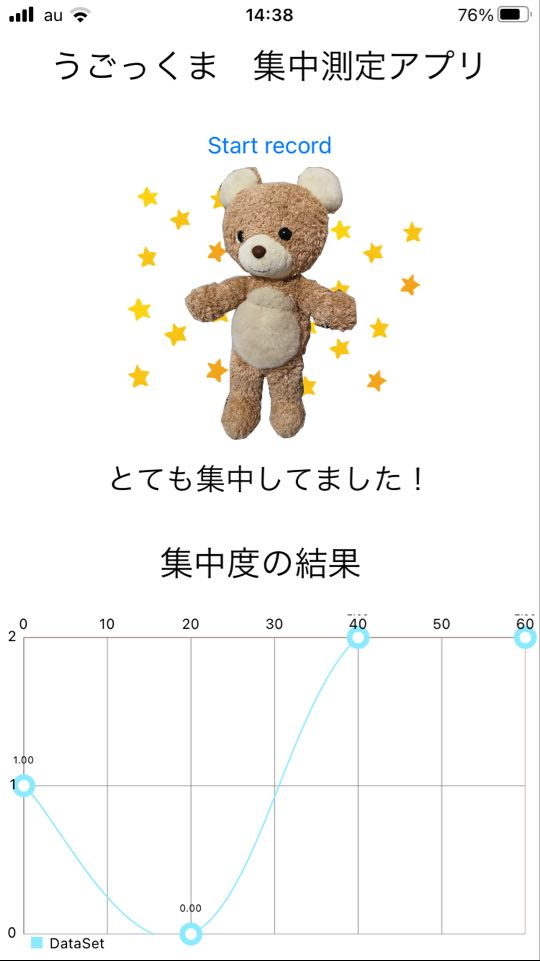

# うごっくま

テレワークの作業中に一人で寂しい思いをしたことはありませんか。 
うごっくまは、あなたの感情と集中力で動き、あなたのテレワークを思わずニヤッとさせるものに変身させます。

# Features
コロナ禍でテレワークに注目が集まり，収束後もIT企業を中心にテレワークが続けられると予想されます． 
その中で、テレワーク✖️癒し✖️ぬいぐるみは今までにないアイデアであり，ぬいぐるみが好きな若年層やテレワークに慣れていない中年層を基点として普及可能なシステムとなりました．

# Requirement

* "chart.js": "^2.9.4",
* "core-js": "^3.6.5",
* "firebase": "^9.1.0",
* "vue": "^2.6.11",
* "python": "3.7"
* "Xcode": "13.0"
* "iOS": 15.0

# Acceleration_Collection
集中度測定のためのデータ収集アプリケーション 
SwiftのCore Motionを用いてデータ収集を行い，firestoreにデータを格納する．

# kantengerusa_Geek12
集中度を測定を行うアプリです． 
スマホ側では，集中度の評価を行い，画面に表示を行います． 
また，集中度の結果によってぬいぐるみを動作させます． 

# Author

作成情報を列挙する

* 河中昌樹
* 奈良先端科学技術大学院大学
* kawanaka.masaki.kj1@gmail.com

* 木俣雄太
* 奈良先端科学技術大学院大学
* yutaubinaist@gmail.com

* 佐瀬凌太
* 奈良先端科学技術大学院大学
* yutaubinaist@gmail.com
